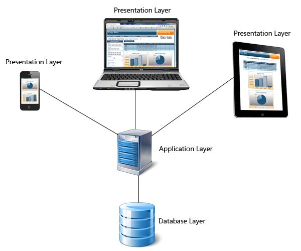
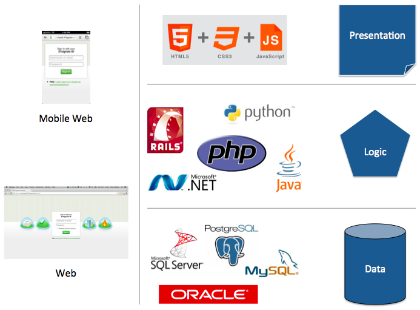

### 3 Tier Architecture-:





### Web architecture




### Basics of SQL:

SQL is not name of a database sql is a query language (Structured query language) used by different database management systems


### Fetching the data:
```
SELECT {1} FROM {2} WHERE {3}={4}
```
* 1: Column name
* 2: Name of the table
* 3: Specific column value

__Example__:
* For getting row where name is Prof Soubhgya
```
SELECT * FROM teachers WHERE name="Prof Soubhgya"
```

* For getting section of Prof Soubhgya
```
SELECT section FROM teachers WHERE name="Prof Soubhgya"
```

* For getting all pf the table
```
SELECT * FROM teachers
```

### Writing the data to the database
```
INSERT INTO {1}( {2} ) VALUES ({3})
```
* 1: Name of the table
* 2: Name of the column
* 3: Value of the column

__Example__:
* For Inserting a new record
```
INSERT INTO teachers(subject, name, section) VALUES("AI" , "siraj", "school_of_ai")
```
* If we need to insert only certain value because we don't know certain values
```
INSERT INTO teachers(name) VALUES ("example")
```

### Updating the value in the database
```
UPDATE {1} SET {2} = {3} WHERE {4}={5}
```
* 1: Name of the table
* 2: Name of the column
* 3: Value of the column we want it to be
* 4: Name of the column
* 5: Value of the column

__Example__:

* Update Sai krishna's Branch
```
UPDATE teachers SET subject=java WHERE name='Prof Soubhgya'
```

### Deleting the data form the database

```
DELETE FROM {1} WHERE {2}={3}
```
* 1: Name of the table
* 2: Name of the column
* 3: Value of the column

__Example__ :
* Deleting example we have created
```
DELETE FROM teachers WHERE name='Prof Soubhgya'
```
* If you want to delete a specific value from the table you can't do that through delete
```
UPDATE teachers SET section=null WHERE name='Prof Soubhgya'
```

<br>


### Teacher's
| Subject (subject)   | Name of the Prof(name)    | Section(section)|
| :------------- | :------------- | :-----------|
| Computer Graphics      | Prof Soubhgya       | C1  |
|   Java  | Prof Karthikeyan       | C1  |
| Statistics       | Prof  Santanu      | C1  |
| Data Anylatics       | Prof   Hari Kishan     | C1  |
| ECE      | Prof   Umakanth Nanda     | C1  |
|  Computer Graphics     | Prof  Sibbi   | C2  |
|   Java    | Prof  Karthikeyan   | C2  |
|  Statistics     | Prof Sudhakar    | C2  |
|   Data Anylatics    | Prof Vijaya    | C2  |
|    ECE   | Prof Umakanth Nanda     | C2  |
